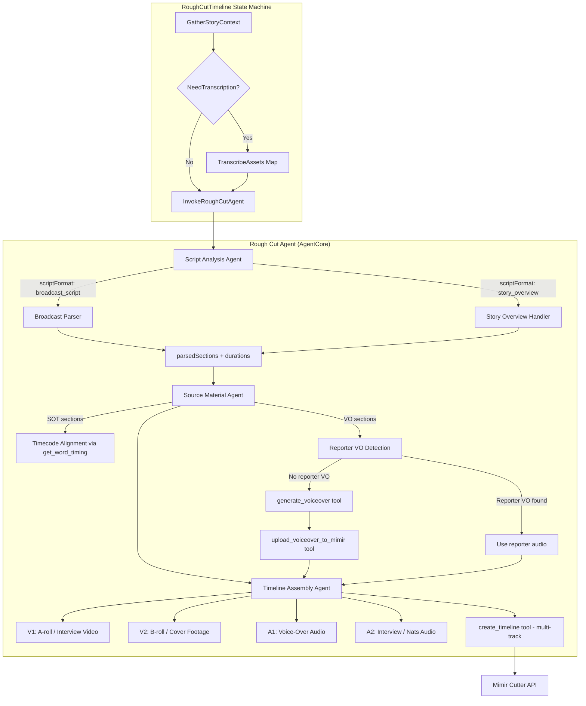
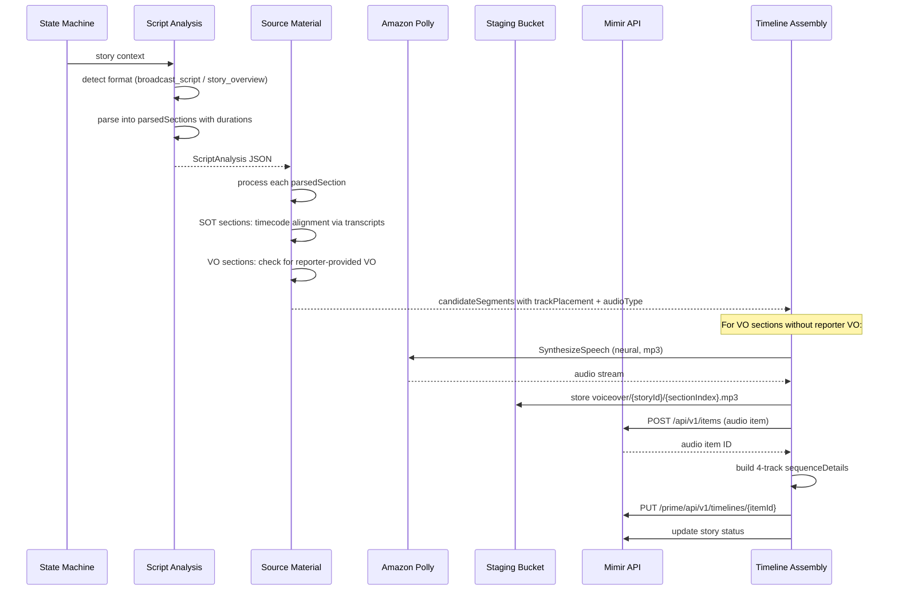

# Design Document: Rough Cut Quality Improvements

## Overview

This design extends the existing Rough Cut Agent pipeline to achieve full script coverage and broadcast-quality timeline output. The current pipeline produces a working Cutter-compatible timeline but covers only a fraction of the source script. These improvements address five core gaps:

1. **Script format detection and broadcast parsing** — The Script Analysis Agent gains the ability to distinguish broadcast scripts from story overviews and parse broadcast scripts into ordered, typed sections (`pkg_vo`, `pkg_sot`, `pkg_nats`, etc.) with preserved timecodes.

2. **Polly voice-over generation** — A new `generate_voiceover` tool synthesizes VO narration text into MP3 audio via Amazon Polly, stores it in the staging bucket, and uploads it to Mimir as an audio item so the Cutter timeline can reference it.

3. **SOT timecode alignment** — The Source Material Agent uses timecoded SOT references from the parsed script to locate exact in/out points in generated transcripts via word-level timing data.

4. **Multi-track timeline assembly** — The Timeline Assembly Agent builds a 4+ track timeline (V1 A-roll, V2 B-roll, A1 voice-over, A2 interview/nats) and the `create_timeline` tool is extended to support audio-only source references.

5. **Model upgrade** — The Source Material and Timeline Assembly agents support a configurable model ID via `AGENT_MODEL_ID` environment variable, enabling evaluation of Claude models on Bedrock.

The changes are confined to the agent code (`rough_cut_agent.py`, `tools.py`, `prompts.py`), the CDK infrastructure (`agentcore-stack.ts`, `infrastructure-stack.ts`), and the state machine orchestration. No new Lambdas are required — the Polly integration lives entirely within the agent's Python tools.

## Architecture



### Data Flow



## Components and Interfaces

### 1. Script Analysis Agent — Enhanced

**File:** `agents/rough-cut-agent/prompts.py` (SCRIPT_ANALYSIS_PROMPT updated)
**File:** `agents/rough-cut-agent/rough_cut_agent.py` (`run_script_analysis` updated)

The Script Analysis Agent is enhanced with two new capabilities:

#### 1a. Script Format Detection

The agent classifies input as `broadcast_script` or `story_overview` based on the overall structure and detail level of the content — not by checking for specific markers. The agent uses editorial judgment:

- `broadcast_script`: Content reads as a producible script with specific narration text, attributed quotes or soundbites, and a clear narrative flow that could be directly read or assembled into a package. May or may not have formal broadcast cue markers.
- `story_overview`: Content consists of notes, bullet points, topic summaries, or high-level descriptions that lack specific narration wording or attributed quotes.

The `scriptFormat` field is added to the ScriptAnalysis output JSON.

#### 1b. Broadcast Script Parser

When `scriptFormat` is `broadcast_script`, the agent parses the script into an ordered `parsedSections` array. Each section has:

```json
{
  "sectionType": "anchor_intro | reporter_live | pkg_vo | pkg_sot | pkg_nats | live_tag | anchor_qa | super",
  "content": "raw script text for this section",
  "orderIndex": 0,
  "estimatedDurationMs": 12000,
  "timecodeSeconds": 314,
  "speaker": "Selena",
  "quotedText": "All Palestinians suffered..."
}
```

`timecodeSeconds`, `speaker`, and `quotedText` are only present for `pkg_sot` sections.

#### 1c. Duration Estimation

Each section gets an `estimatedDurationMs` based on type:
- `pkg_vo`: word count × (60000 / 150) = ~400ms per word
- `pkg_sot`: explicit timecode duration if available, otherwise word count estimate
- `pkg_nats`: 3000ms default
- Other types: word count estimate at 150 WPM

A `totalEstimatedDurationMs` field sums all section durations.

#### 1d. Story Overview Fallback

When `scriptFormat` is `story_overview`, the agent constructs a synthetic `parsedSections` array from the existing lead/body/wrapUp analysis, mapping them to VO sections with interview segments mapped to SOT sections.

#### Validation Changes

`_validate_script_analysis` is updated to:
- Require `scriptFormat` field with value `broadcast_script` or `story_overview`
- Require `parsedSections` array
- Require `totalEstimatedDurationMs` number
- Keep existing validation for backward-compatible fields

### 2. Source Material Agent — Enhanced

**File:** `agents/rough-cut-agent/prompts.py` (SOURCE_MATERIAL_PROMPT updated)

#### 2a. SOT Timecode Alignment

For `pkg_sot` sections with `timecodeSeconds`, the agent:
1. Converts the timecode to a 30-second search window: `[timecodeSeconds - 15, timecodeSeconds + 15]`
2. Calls `get_word_timing(mimir_item_id, start_time, end_time)` to get word-level data in that window
3. Matches the `quotedText` against transcript words using substring matching
4. Sets `inPointMs` to the first matching word's `startTime × 1000` and `outPointMs` to the last matching word's `endTime × 1000 + 500` (500ms pad)
5. If no match in the 30s window, expands to the full transcript and sets `matchConfidence: "low"`

Each SOT candidate includes a `matchConfidence` field: `high` (timecode + text match), `medium` (text match only), or `low` (expanded search).

#### 2b. Reporter-Provided VO Detection

For `pkg_vo` sections, before flagging for Polly synthesis, the agent:
1. Searches generated transcripts for content matching the VO narration text
2. Computes word overlap percentage between VO script text and transcript content
3. If overlap ≥ 70% and the asset is audio-only or single-speaker video → marks as `reporter_provided`
4. Otherwise → marks as `polly_generated`

Each VO candidate includes a `voiceoverSource` field: `reporter_provided` or `polly_generated`.

#### 2c. Track Placement Tagging

Each candidate segment includes:
- `trackPlacement`: `v1_aroll` (SOT/interview) or `v2_broll` (B-roll/cover)
- `audioType`: `interview` (SOT), `nats` (natural sound), or `none` (VO-accompanied B-roll)

#### 2d. Coverage Tracking

The output includes a `coveragePercentage` field. If below 80%, the agent performs a second pass with `top_k=20` for unmatched sections.

### 3. Timeline Assembly Agent — Enhanced

**File:** `agents/rough-cut-agent/prompts.py` (TIMELINE_ASSEMBLY_PROMPT updated)
**File:** `agents/rough-cut-agent/rough_cut_agent.py` (`run_timeline_assembly` updated)

#### 3a. Multi-Track Layout

The agent builds a minimum of 4 tracks:
- **V1** (`id: 1, mediaType: "video"`): A-roll — interview/SOT video, reporter standup
- **V2** (`id: 2, mediaType: "video"`): B-roll — cover footage accompanying VO sections
- **A1** (`id: 3, mediaType: "audio"`): Voice-over narration audio (Polly or reporter-provided)
- **A2** (`id: 4, mediaType: "audio"`): Interview audio and natural sound

#### 3b. VO Section Handling

For each VO section:
1. If `voiceoverSource` is `polly_generated`: call `generate_voiceover` tool, then `upload_voiceover_to_mimir` tool
2. If `voiceoverSource` is `reporter_provided`: use the matched asset's audio
3. Place the audio clip on A1, aligned to the timeline position of the VO section
4. Place accompanying B-roll on V2, aligned to match the A1 clip's start/end

#### 3c. Placeholder Gaps

If a script section has no matched candidates after both passes, the agent inserts a placeholder gap of `estimatedDurationMs` on the timeline and records it in the output summary.

### 4. New Agent Tools

**File:** `agents/rough-cut-agent/tools.py`

#### 4a. `generate_voiceover` Tool

```python
@tool
def generate_voiceover(text: str, story_id: str, section_index: int) -> str:
    """Synthesize voice-over audio from text using Amazon Polly.

    Calls Polly SynthesizeSpeech with neural engine, mp3 output,
    and configurable voice ID. Stores the result in S3 at
    voiceover/{story_id}/{section_index}.mp3.

    Args:
        text: The narration text to synthesize.
        story_id: The story ID for S3 key organization.
        section_index: The section index for S3 key organization.

    Returns:
        JSON with s3Uri, durationMs, and sectionIndex.
    """
```

**Logic:**
1. Read `POLLY_VOICE_ID` from env (default: `Matthew`)
2. Read `TRANSCRIPT_STAGING_BUCKET` from env
3. Call `polly.synthesize_speech(Text=text, OutputFormat='mp3', Engine='neural', VoiceId=voice_id)`
4. Store audio stream to S3 at `voiceover/{story_id}/{section_index}.mp3`
5. Estimate duration from audio byte length: `duration_ms = len(audio_bytes) / (bitrate / 8) * 1000` where bitrate is ~48kbps for Polly neural MP3
6. Return `{"s3Uri": "s3://bucket/voiceover/...", "durationMs": duration_ms, "sectionIndex": section_index}`
7. On Polly error: log and return `{"error": "...", "sectionIndex": section_index}`

#### 4b. `upload_voiceover_to_mimir` Tool

```python
@tool
def upload_voiceover_to_mimir(s3_uri: str, story_title: str, section_index: int, parent_item_ids: list[str]) -> str:
    """Create a Mimir audio item for a synthesized voice-over file.

    Creates an audio item in Mimir with the title
    "{storyTitle} - VO {sectionIndex}" and associates it as a child
    of the specified parent items.

    Args:
        s3_uri: The S3 URI of the voice-over audio file.
        story_title: The story title for naming the Mimir item.
        section_index: The section index for naming.
        parent_item_ids: List of parent Mimir item IDs.

    Returns:
        JSON with the created Mimir item ID.
    """
```

**Logic:**
1. Call `POST /api/v1/items` with `{"title": "{story_title} - VO {section_index}", "itemType": "audio", "parentItemIds": parent_item_ids}`
2. Return `{"mimirItemId": item_id, "title": title}`
3. On error: log and return `{"error": "..."}`

#### 4c. `create_timeline` Tool — Extended

The existing `create_timeline` tool in `tools.py` is extended to:
1. Process clips from all tracks (V1, V2, A1, A2), not just video tracks
2. Support `audio-only` source references for Polly-generated clips:
   - `itemRef` with `type: "audio"` and `nAudioChannels: 1`
   - `sourceRef` with `type: "audio-only"` referencing the Mimir audio item ID
3. Build the Cutter payload with multiple `videoTracks` arrays (V1, V2) and place audio clips on the appropriate `audioTracks` slots

### 5. Model Upgrade Support

**File:** `agents/rough-cut-agent/rough_cut_agent.py`

#### 5a. Configurable Model ID

`run_source_material` and `run_timeline_assembly` read `AGENT_MODEL_ID` from environment:
- If set and accessible → use it as the `model_id` for `BedrockModel`
- If set to a Claude model → set `max_tokens` to 16000
- If not accessible → fall back to `us.amazon.nova-premier-v1:0` and log a warning

#### 5b. Model Validation

Before creating the agent, attempt a lightweight Bedrock call (e.g., `list_foundation_models` or a minimal `invoke_model`) to verify the model is accessible. On failure, fall back to the default.

### 6. CDK Infrastructure Changes

**File:** `fonn-group-custom-actions/lib/agentcore-stack.ts`

#### 6a. Polly IAM Permissions

Add to the shared AgentCore execution role:

```typescript
sharedRole.addToPolicy(new iam.PolicyStatement({
  effect: iam.Effect.ALLOW,
  actions: ['polly:SynthesizeSpeech'],
  resources: ['*'],
}));
```

#### 6b. S3 Write Permissions for Voice-Over

Add S3 write access to the staging bucket for the `voiceover/` prefix:

```typescript
sharedRole.addToPolicy(new iam.PolicyStatement({
  effect: iam.Effect.ALLOW,
  actions: ['s3:PutObject'],
  resources: [`arn:aws:s3:::video-embedding-staging-*/*`],
}));
```

#### 6c. New Environment Variables

Add to the rough-cut-agent environment:

```typescript
POLLY_VOICE_ID: 'Matthew',
AGENT_MODEL_ID: '',  // empty = use default Nova Premier
```

## Data Models

### ScriptAnalysis Output (Extended)

```typescript
interface ScriptAnalysis {
  scriptFormat: 'broadcast_script' | 'story_overview';
  parsedSections: ParsedSection[];
  totalEstimatedDurationMs: number;
  // Existing fields preserved for backward compatibility
  lead: { content: string; hookType: string; estimatedDurationMs: number };
  body: { mainPoints: MainPoint[] };
  wrapUp: { content: string; closureType: string };
  soundbites: Soundbite[];
  interviewSegments: InterviewSegment[];
  voiceOverSections: VoiceOverSection[];
}

interface ParsedSection {
  sectionType: 'anchor_intro' | 'reporter_live' | 'pkg_vo' | 'pkg_sot' | 'pkg_nats' | 'live_tag' | 'anchor_qa' | 'super';
  content: string;
  orderIndex: number;
  estimatedDurationMs: number;
  timecodeSeconds?: number;   // SOT sections only
  speaker?: string;           // SOT sections only
  quotedText?: string;        // SOT sections only
}
```

### Source Material Output (Extended)

```typescript
interface SourceMaterialOutput {
  candidateSegments: CandidateSegment[];
  gaps: Gap[];
  coveragePercentage: number;
}

interface CandidateSegment {
  scriptSection: string;
  candidates: Candidate[];
}

interface Candidate {
  mimirItemId: string;
  inPointMs: number;
  outPointMs: number;
  relevanceScore: number;
  matchType: 'transcript' | 'embedding' | 'both';
  content: string;
  matchConfidence?: 'high' | 'medium' | 'low';  // SOT sections
  trackPlacement: 'v1_aroll' | 'v2_broll';
  audioType: 'interview' | 'nats' | 'none';
  voiceoverSource?: 'reporter_provided' | 'polly_generated';  // VO sections
}
```

### Timeline Assembly Output (Extended)

```typescript
interface TimelineAssemblyOutput {
  timelineItemId: string;
  summary: {
    clipCount: number;
    totalDurationMs: number;
    trackCount: number;
    coveragePercentage: number;
    voiceoverClipCount: number;
    gapCount: number;
  };
  sequenceDetails: {
    tracks: Track[];
  };
}

interface Track {
  id: number;
  name: string;
  mediaType: 'video' | 'audio';
  clips: Clip[];
}

interface Clip {
  start: number;
  end: number;
  duration: number;
  inPoint: number;
  outPoint: number;
  mimirItemId: string;
  sourceType?: 'video-with-audio' | 'audio-only';
}
```

### Voice-Over Metadata (New)

```typescript
interface VoiceOverMetadata {
  sectionIndex: number;
  s3Uri: string;
  durationMs: number;
  mimirItemId?: string;  // set after upload to Mimir
  voiceoverSource: 'polly_generated' | 'reporter_provided';
}
```

### Cutter Timeline Payload — Audio-Only Source Reference (New)

For Polly-generated audio clips, the Cutter payload uses:

```json
{
  "itemRefs": {
    "polly-vo-item-id": {
      "type": "audio",
      "nAudioChannels": 1,
      "durationInSeconds": { "numerator": 12000, "denominator": 1000 }
    }
  },
  "sourceRefs": {
    "src-vo-0": {
      "type": "audio-only",
      "itemId": "polly-vo-item-id",
      "mediaStartOffset": { "numerator": 0, "denominator": 1000 },
      "audioInPoint": { "numerator": 0, "denominator": 1000 },
      "audioOutPoint": { "numerator": 12000, "denominator": 1000 }
    }
  }
}
```

