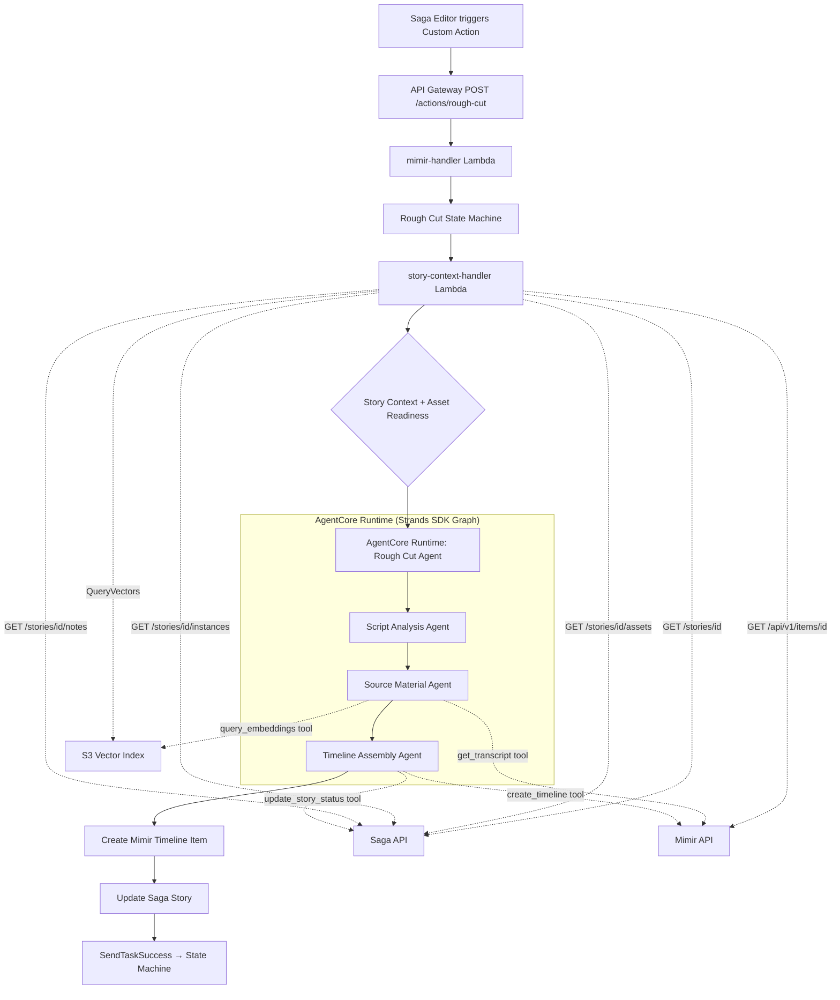
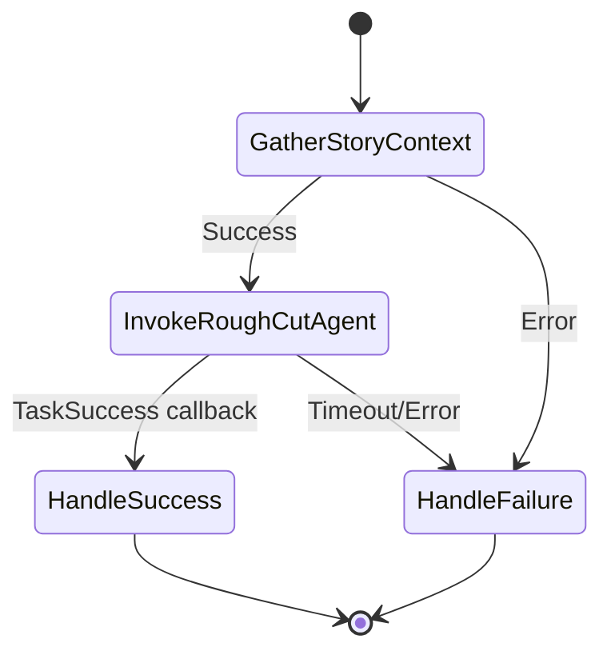

# Design Document: Rough Cut Timeline Agent

## Overview

This design describes a multi-agent pipeline that generates rough cut video timelines from Saga stories. When a Saga editor triggers the "Generate Rough Cut" custom action, the system:

1. Routes the request through the existing `mimir-handler` Lambda to a new Step Functions state machine
2. Gathers story context (details, assets, instances, notes) from the Saga API via a new Lambda
3. Evaluates asset readiness by checking for embeddings in the S3 Vector Index and transcripts in Mimir
4. Invokes a multi-agent system on AgentCore Runtime that analyzes the script, searches source material, and assembles a timeline
5. Creates a new Mimir item with `sequenceDetails` representing the rough cut
6. Updates the Saga story with a reference to the generated timeline

The pipeline follows the established patterns in the `fonn-group-custom-actions` project: API Gateway → `mimir-handler` → Step Functions → Lambda/AgentCore, using JSONata for state management and the `MultiAgentCore` CDK construct for agent deployment.

## Architecture



### State Machine Flow



## Components and Interfaces

### 1. API Gateway Route

A new resource `/actions/rough-cut` on the existing `MimirCustomActionsApi` API Gateway, integrated with the existing `mimir-handler` Lambda.

### 2. mimir-handler Lambda (Modified)

Add a `rough-cut` case to the existing switch statement in `lambda/mimir-handler/index.js`. The handler validates the API key, extracts the story ID from the request body, and starts the `RoughCutTimeline` state machine. The request body from Saga custom actions contains `items` (with story context), `userToken`, `actionData`, `userId`, and `userEmail`.

**Interface change:**
```javascript
case 'rough-cut':
  stateMachineArn = process.env.ROUGH_CUT_STATE_MACHINE_ARN;
  // No item filtering needed — story context comes from actionData
  if (!items || items.length === 0) {
    return { statusCode: 200, headers: corsHeaders, body: JSON.stringify({
      message: 'No items found to process for rough-cut', status: 'success', processedItems: []
    })};
  }
  break;
```

### 3. story-context-handler Lambda (New)

**Path:** `lambda/story-context-handler/index.js`

Fetches story context from Saga API and evaluates asset readiness.

**Input:**
```json
{
  "storyId": "string",
  "sagaApiKeySecretArn": "string",
  "sagaApiUrlSecretArn": "string",
  "mimirApiKey": "string"
}
```

**Output:**
```json
{
  "story": { "id": "string", "title": "string", "description": "string", "script": "string", ... },
  "assets": [
    {
      "id": "string",
      "mimirItemId": "string",
      "hasEmbeddings": true,
      "hasTranscript": true,
      "warning": null
    }
  ],
  "instances": [...],
  "notes": [...]
}
```

**Logic:**
1. Retrieve Saga API key and URL from Secrets Manager (cached)
2. Call `GET /stories/{id}` for story details
3. Call `GET /stories/{id}/assets` for asset list
4. Call `GET /stories/{id}/instances` for broadcast instances
5. Call `GET /stories/{id}/notes` for editorial notes
6. For each video asset:
   - Query S3 Vector Index (`QueryVectors` with `itemId` metadata filter) to check for embeddings
   - Call Mimir API `GET /api/v1/items/{itemId}` to check `timedTranscriptUrl`
7. Return enriched context

### 4. Rough Cut State Machine (New)

**Name:** `RoughCutTimeline`  
**Type:** Standard  
**Timeout:** 35 minutes  
**Query Language:** JSONata

**States:**
1. **GatherStoryContext** — Invoke `story-context-handler` Lambda with story ID and credentials
2. **InvokeRoughCutAgent** — Invoke AgentCore Runtime with `waitForTaskToken` pattern, passing story context, enriched assets, and task token. Timeout: 30 minutes.
3. **HandleSuccess** — Terminal success state
4. **HandleFailure** — Terminal failure state

**Retry configuration:** Exponential backoff on `Lambda.ServiceException` and `Lambda.AWSLambdaException` (2s interval, 3 max attempts, 2x backoff).

### 5. Rough Cut Agent (New — AgentCore Runtime)

**Path:** `agents/rough-cut-agent/`  
**Runtime:** Python on AgentCore Runtime via `MultiAgentCore` construct  
**SDK:** Strands SDK with `GraphBuilder` pattern

The agent is a multi-agent graph with three nodes:

#### 5a. Script Analysis Agent (Graph Node)

**Input:** Story details, description, script, editorial notes  
**Output:** Structured analysis document

Analyzes the story script using the broadcast news structure pattern (similar to `story_structuring.py` in `editor-agent`):
- **Lead:** Opening hook, 15-20 seconds, 5W's
- **Body:** Main narrative points with supporting elements
- **Wrap-up:** Conclusion, call-to-action, or forward-looking perspective
- Identifies soundbite candidates with speaker attributions and estimated durations
- Identifies interview segments and voice-over sections

#### 5b. Source Material Agent (Graph Node)

**Input:** Script analysis, enriched asset list  
**Output:** Ranked candidate segments with in/out points

Tools available:
- `get_mimir_item_details(mimir_item_id)` — Fetches full item details from Mimir API (duration, technical metadata, proxy URL, transcript URL, frame rate). Saga assets only provide `mimirItemId` references; the agent must call Mimir to get the actual item data needed for timeline construction.
- `get_transcript(mimir_item_id)` — Fetches timed transcript JSON from `timedTranscriptUrl`
- `query_embeddings(text, top_k=10)` — Generates text embedding via Nova model, queries S3 Vector Index, returns results with segment timing metadata

Logic:
1. For each asset with `hasTranscript=true`, fetch the timed transcript
2. For each narrative segment from the script analysis, query embeddings for semantically similar video segments
3. Rank candidates by combined transcript keyword match and embedding similarity score
4. Resolve precise in/out points using word-level timing from timed transcripts, aligning to sentence/phrase boundaries
5. Report gaps where no matching segments are found

#### 5c. Timeline Assembly Agent (Graph Node)

**Input:** Script analysis, ranked candidate segments  
**Output:** Mimir timeline item ID, summary

Tools available:
- `create_timeline(title, sequence_details, parent_item_ids)` — POST /api/v1/items on Mimir API with `sequenceDetails` payload
- `update_story_status(story_id, timeline_item_id)` — PATCH /stories/{id} on Saga API
- `get_mimir_item_details(item_id)` — GET /api/v1/items/{itemId} on Mimir API

Logic:
1. Construct `sequenceDetails` object with tracks:
   - Video track: clips ordered lead → body → wrap-up
   - Audio track(s): separate track for voice-over vs. interview/natural sound
2. Each clip specifies `start`, `end`, `duration`, `inPoint`, `outPoint`, `mimirItemId`
3. Ensure no overlapping clips on the same track (each clip's `start` >= previous clip's `end`)
4. Create Mimir item via `create_timeline` tool with title `"{story_title} - Rough Cut"`
5. Update Saga story via `update_story_status` tool
6. Send `SendTaskSuccess` callback with timeline item ID and summary

### 6. Agent Tools

All tools authenticate using credentials retrieved from environment variables (secret ARNs) at agent startup.

| Tool | API | Auth Header | Purpose |
|------|-----|-------------|---------|
| `get_mimir_item_details` | GET /api/v1/items/{id} | `x-mimir-cognito-id-token: Bearer {key}` | Item metadata, proxy URL, transcript URL |
| `get_transcript` | GET {timedTranscriptUrl} | `x-mimir-cognito-id-token: Bearer {key}` | Word-level timed transcript |
| `query_embeddings` | Bedrock InvokeModel + S3Vectors QueryVectors | AWS SDK credentials | Semantic search over video segments |
| `create_timeline` | POST /api/v1/items | `x-mimir-cognito-id-token: Bearer {key}` | Create timeline item with sequenceDetails |
| `update_story_status` | PATCH /stories/{id} | `x-api-key: {key}` | Update story metadata with timeline reference |

### 7. CDK Infrastructure Changes

**infrastructure-stack.ts changes:**
- Add `rough-cut` resource to existing API Gateway
- Add `ROUGH_CUT_STATE_MACHINE_ARN` env var to `mimir-handler`
- Grant `mimir-handler` permission to start the new state machine

**New resources (can be in infrastructure-stack or a dedicated section):**
- `story-context-handler` Lambda with Secrets Manager read, S3 Vectors query, and Mimir API access
- `RoughCutTimeline` Step Functions state machine (JSONata, Standard, 35min timeout)
- SSM parameter `/fonn-custom-actions/agentcore/rough-cut-agent/runtime-arn`

**agentcore-stack.ts changes:**
- Add `rough-cut-agent` to the `MultiAgentCore` agents array
- Configure environment variables: Mimir API key secret ARN, Saga API key secret ARN, Saga API URL secret ARN, Vector Bucket name, Vector Index name

**IAM permissions:**
- `story-context-handler`: read Saga API key/URL secrets, read Mimir API key secret, `s3vectors:QueryVectors` and `s3vectors:ListVectors` on vector index
- `mimir-handler`: `states:StartExecution` on `RoughCutTimeline` state machine
- State machine role: invoke `story-context-handler`, `bedrock-agentcore:InvokeAgentRuntime`
- AgentCore execution role: read secrets, invoke Bedrock models, S3 Vectors query/put, `states:SendTaskSuccess`/`states:SendTaskFailure`

## Data Models

### Sequence Details (Mimir Timeline)

```typescript
interface SequenceDetails {
  tracks: Track[];
}

interface Track {
  id: string;
  name: string;
  mediaType: 'video' | 'audio';
  clips: Clip[];
}

interface Clip {
  start: number;      // Position in new timeline (ms)
  end: number;        // End position in new timeline (ms)
  duration: number;   // Duration (ms), must equal end - start
  inPoint: number;    // Start in source clip (ms)
  outPoint: number;   // End in source clip (ms)
  mimirItemId: string; // Source Mimir item ID
}
```

**Invariants:**
- `clip.duration === clip.end - clip.start`
- `clip.duration === clip.outPoint - clip.inPoint`
- `clip.start >= 0`, `clip.end > clip.start`
- `clip.inPoint >= 0`, `clip.outPoint > clip.inPoint`
- For clips on the same track, ordered by `start`: `clips[i].end <= clips[i+1].start` (no overlap)

### Script Analysis Output

```typescript
interface ScriptAnalysis {
  lead: {
    content: string;
    hookType: 'human_interest' | 'breaking_news' | 'conflict' | 'mystery';
    estimatedDurationMs: number;
  };
  body: {
    mainPoints: Array<{
      content: string;
      supportingElements: string[];
      narrativeFunction: string;
    }>;
  };
  wrapUp: {
    content: string;
    closureType: 'resolution' | 'call_to_action' | 'forward_looking';
  };
  soundbites: Array<{
    speaker: string;
    content: string;
    estimatedDurationMs: number;
  }>;
  interviewSegments: Array<{
    speaker: string;
    topic: string;
  }>;
  voiceOverSections: Array<{
    content: string;
    narrativePosition: 'lead' | 'body' | 'wrap_up';
  }>;
}
```

### Enriched Asset

```typescript
interface EnrichedAsset {
  id: string;
  mimirItemId: string;
  title: string;
  itemType: string;
  hasEmbeddings: boolean;
  hasTranscript: boolean;
  timedTranscriptUrl?: string;
  warning?: string; // Set when both flags are false
}
```

### Story Context (Lambda Output)

```typescript
interface StoryContext {
  story: {
    id: string;
    title: string;
    description: string;
    script: string;
    metadata: Record<string, any>;
  };
  assets: EnrichedAsset[];
  instances: Array<{
    id: string;
    rundownId?: string;
    broadcastDate?: string;
  }>;
  notes: Array<{
    id: string;
    type: string;
    content: string;
  }>;
}
```


## Correctness Properties

*A property is a characteristic or behavior that should hold true across all valid executions of a system — essentially, a formal statement about what the system should do. Properties serve as the bridge between human-readable specifications and machine-verifiable correctness guarantees.*

### Property 1: Handler routes rough-cut action and passes complete payload

*For any* valid request to the mimir-handler with action type `rough-cut`, a non-empty items array, and a valid API key, the handler shall start the Rough Cut State Machine with an input object containing all required fields: items, userToken, actionData, userId, userEmail, and mimirApiKey.

**Validates: Requirements 1.2, 1.3**

### Property 2: Invalid requests are rejected without starting state machine

*For any* request to the mimir-handler where the API key is invalid or the items array is empty, the handler shall return a response without invoking `StartExecutionCommand`, and the response shall indicate the error condition.

**Validates: Requirements 1.5**

### Property 3: All outgoing API calls include correct authentication headers

*For any* outgoing HTTP request made by the story-context-handler to the Saga API, the request shall include the `x-api-key` header. *For any* outgoing HTTP request made by agent tools to the Mimir API, the request shall include the `x-mimir-cognito-id-token: Bearer {key}` header. No API call shall be made without the appropriate authentication header.

**Validates: Requirements 2.5, 8.6**

### Property 4: Saga API error responses include endpoint path and HTTP status code

*For any* Saga API call that returns a non-2xx HTTP status code, the error object returned by the story-context-handler shall contain both the endpoint path (e.g., `/stories/{id}/assets`) and the HTTP status code in its message.

**Validates: Requirements 2.6**

### Property 5: Asset enrichment produces correct boolean flags

*For any* list of video assets, the enriched asset list returned by the story-context-handler shall have the same length as the input list, and each enriched asset shall have `hasEmbeddings` set to `true` if and only if the Vector Index contains vectors with a matching `itemId`, and `hasTranscript` set to `true` if and only if the Mimir item has a non-empty `timedTranscriptUrl`. Assets with both flags `false` shall include a warning message.

**Validates: Requirements 3.1, 3.2, 3.3, 3.4**

### Property 6: Script analysis output conforms to schema

*For any* valid story context input (containing at least a title and some script/description content), the Script Analysis Agent's output shall be a valid object containing `lead` (with `content`, `hookType`, `estimatedDurationMs`), `body` (with `mainPoints` array), and `wrapUp` (with `content`, `closureType`) fields.

**Validates: Requirements 5.2, 5.5**

### Property 7: Transcript tool invoked only for transcript-ready assets

*For any* enriched asset list passed to the Source Material Agent, the `get_transcript` tool shall be called only for assets where `hasTranscript` is `true`. The number of `get_transcript` invocations shall equal the count of assets with `hasTranscript === true`.

**Validates: Requirements 6.1**

### Property 8: Candidate segments are sorted by relevance score descending

*For any* list of candidate video segments returned by the Source Material Agent for a given script section, the segments shall be sorted by their combined relevance score in descending order.

**Validates: Requirements 6.3**

### Property 9: Resolved in/out points fall within source clip bounds

*For any* resolved in/out point pair produced by the Source Material Agent, `inPoint >= 0` and `outPoint > inPoint`, and both values shall fall within the duration of the source Mimir item.

**Validates: Requirements 6.4**

### Property 10: Timeline clips are structurally valid with no overlaps

*For any* generated `sequenceDetails` object, every clip shall have all required fields (`start`, `end`, `duration`, `inPoint`, `outPoint`, `mimirItemId`), and the following invariants shall hold: `duration === end - start`, `duration === outPoint - inPoint`, `start >= 0`, `inPoint >= 0`. Furthermore, for any track, when clips are sorted by `start`, `clips[i].end <= clips[i+1].start` (no overlapping clips on the same track).

**Validates: Requirements 7.3, 7.5**

### Property 11: Timeline clips follow narrative order

*For any* generated timeline, clips mapped to the "lead" narrative section shall have `start` values less than clips mapped to "body" sections, which shall have `start` values less than clips mapped to "wrap_up" sections, on the primary video track.

**Validates: Requirements 7.1**

### Property 12: Voice-over clips are on a separate track from interview clips

*For any* generated timeline containing both voice-over and interview/natural-sound clips, no track shall contain both voice-over clips and interview/natural-sound clips.

**Validates: Requirements 7.4**

### Property 13: Embedding query returns bounded results with timing metadata

*For any* call to the `query_embeddings` tool with a `top_k` parameter, the number of returned results shall be less than or equal to `top_k`, and each result shall include `startTimeSeconds` and `endTimeSeconds` metadata fields.

**Validates: Requirements 8.3**

### Property 14: Step Functions callbacks contain required fields

*For any* successful agent execution, the `SendTaskSuccess` payload shall contain `timelineItemId` (non-empty string) and `summary` (object with `clipCount`, `totalDurationMs`, `trackCount`). *For any* failed agent execution, the `SendTaskFailure` payload shall contain `error` and `cause` fields.

**Validates: Requirements 9.2, 9.4**

## Error Handling

### story-context-handler Lambda

| Error Condition | Handling |
|----------------|----------|
| Secrets Manager read failure | Throw with descriptive message; state machine retries with backoff |
| Saga API 4xx/5xx | Return error object with endpoint path and status code; state machine transitions to failure |
| Mimir API failure during transcript check | Set `hasTranscript: false` for that asset; continue processing other assets |
| Vector Index query failure | Set `hasEmbeddings: false` for that asset; continue processing other assets |
| No video assets in story | Return empty enriched asset list with warning; agent handles gracefully |

### mimir-handler Lambda

| Error Condition | Handling |
|----------------|----------|
| Invalid API key | Return 401 with `{ message: 'Unauthorized', status: 'error' }` |
| Empty items array | Return 200 with `{ message: 'No items found...', status: 'success' }` |
| Step Functions StartExecution failure | Return 200 with error message (existing pattern) |

### Rough Cut State Machine

| Error Condition | Handling |
|----------------|----------|
| story-context-handler failure | Transition to HandleFailure state; no AgentCore invocation |
| AgentCore timeout (30 min) | Transition to HandleFailure with timeout error |
| AgentCore invocation error | Caught by Catch block; transition to HandleFailure |
| Transient Lambda errors | Retry with exponential backoff (2s, 3 attempts, 2x rate) |

### Rough Cut Agent

| Error Condition | Handling |
|----------------|----------|
| Mimir API create_timeline failure | Retry once; if retry fails, send `SendTaskFailure` |
| No matching segments for script section | Report gap in output; continue with available segments |
| Transcript fetch failure | Skip asset; use embedding-only search for that asset |
| Embedding query failure | Fall back to transcript-only search for that narrative segment |
| Unrecoverable error | Send `SendTaskFailure` with error details and cause |

## Testing Strategy

### Unit Tests

Unit tests verify specific examples, edge cases, and integration points:

- **mimir-handler routing:** Verify `rough-cut` action type routes to correct state machine ARN
- **story-context-handler:** Test with mocked Saga/Mimir APIs for various response scenarios (success, 404, 500, empty assets)
- **Asset enrichment edge cases:** Asset with no embeddings and no transcript gets warning; asset with only embeddings; asset with only transcript
- **Clip building:** Verify clip objects are correctly constructed from in/out points and timeline positions
- **Sequence details construction:** Verify tracks are correctly separated by media type
- **Error formatting:** Verify Saga API errors include endpoint path and status code

### Property-Based Tests

Property-based tests verify universal properties across generated inputs. Use `hypothesis` (Python) for agent-side tests and `fast-check` (JavaScript) for Lambda-side tests.

**Configuration:**
- Minimum 100 iterations per property test
- Each test tagged with: `Feature: rough-cut-timeline-agent, Property {number}: {property_text}`

**JavaScript (Lambda) property tests:**

1. **Property 1 test:** Generate random valid request bodies with varying items, userToken, actionData, userId, userEmail. Verify handler calls StartExecution with all fields present.
   - Tag: `Feature: rough-cut-timeline-agent, Property 1: Handler routes rough-cut action and passes complete payload`

2. **Property 2 test:** Generate random invalid API keys and empty/missing items arrays. Verify no StartExecution call is made.
   - Tag: `Feature: rough-cut-timeline-agent, Property 2: Invalid requests are rejected without starting state machine`

3. **Property 4 test:** Generate random HTTP status codes (400-599) and endpoint paths. Verify error messages contain both.
   - Tag: `Feature: rough-cut-timeline-agent, Property 4: Saga API error responses include endpoint path and HTTP status code`

4. **Property 5 test:** Generate random asset lists with varying embedding/transcript availability. Verify enriched output flags match.
   - Tag: `Feature: rough-cut-timeline-agent, Property 5: Asset enrichment produces correct boolean flags`

**Python (Agent) property tests:**

5. **Property 10 test:** Generate random lists of clips with valid timing values. Verify the timeline assembly function produces clips satisfying all invariants (duration consistency, no overlaps).
   - Tag: `Feature: rough-cut-timeline-agent, Property 10: Timeline clips are structurally valid with no overlaps`

6. **Property 11 test:** Generate random sets of clips tagged with narrative positions (lead, body, wrap_up). Verify assembled timeline maintains narrative order.
   - Tag: `Feature: rough-cut-timeline-agent, Property 11: Timeline clips follow narrative order`

7. **Property 12 test:** Generate random clip lists with mixed voice-over and interview types. Verify track assignment separates them.
   - Tag: `Feature: rough-cut-timeline-agent, Property 12: Voice-over clips are on a separate track from interview clips`

8. **Property 13 test:** Generate random top_k values and mock embedding results. Verify result count <= top_k and all results have timing metadata.
   - Tag: `Feature: rough-cut-timeline-agent, Property 13: Embedding query returns bounded results with timing metadata`

9. **Property 9 test:** Generate random timed transcript data and target phrases. Verify resolved in/out points are within source bounds.
   - Tag: `Feature: rough-cut-timeline-agent, Property 9: Resolved in/out points fall within source clip bounds`

10. **Property 14 test:** Generate random success/failure payloads. Verify callback payloads contain all required fields.
    - Tag: `Feature: rough-cut-timeline-agent, Property 14: Step Functions callbacks contain required fields`
