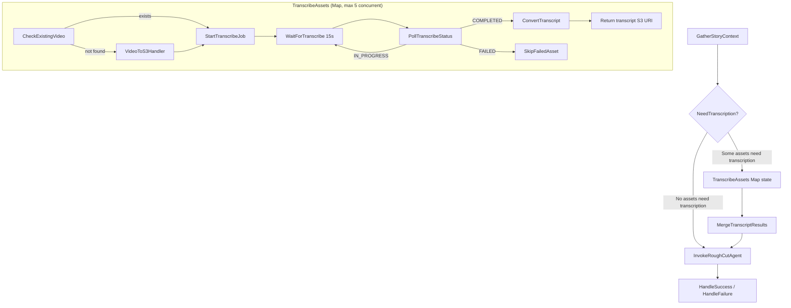
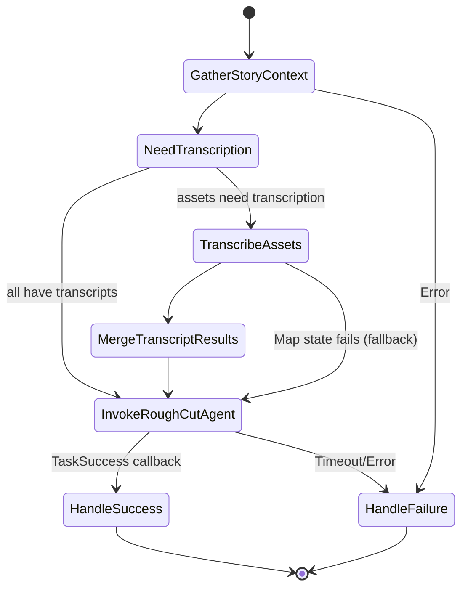

# Design Document: Transcript Generation

## Overview

This design adds a transcript generation step to the existing `RoughCutTimeline` state machine so that video assets lacking Mimir-native transcripts (`hasTranscript: false`) are transcribed via Amazon Transcribe before the Rough Cut Agent runs. The step sits between `GatherStoryContext` and `InvokeRoughCutAgent`.

The pipeline:

1. Filters enriched assets to find video items where `hasTranscript` is `false`
2. For each such asset, checks if the proxy video is already staged in S3 (reusing the embedding pipeline's staging bucket)
3. If not staged, invokes the existing `video-to-s3-handler` Lambda to download the proxy video from Mimir
4. Starts an Amazon Transcribe job on the staged video
5. Polls for Transcribe job completion via a Wait/Choice loop
6. Converts the Transcribe output (word-level JSON) into a simplified timed-word format and saves it to S3
7. Merges generated transcript S3 URIs back into the enriched asset list
8. Passes the updated payload to `InvokeRoughCutAgent`

The agent gains a new `get_generated_transcript` tool that reads the simplified transcript from S3 by item ID, allowing the Source Material Agent to resolve in/out points for assets that lack Mimir-native transcripts.

## Architecture



### Updated State Machine Flow



## Components and Interfaces

### 1. Transcribe Handler Lambda (New)

**Path:** `lambda/transcribe-handler/index.js`  
**Runtime:** Node.js 22.x  
**Timeout:** 60 seconds  
**Memory:** 256 MB

A single Lambda that handles three actions via an `action` field in the event payload:

#### Action: `check-video`

Checks if a video file already exists in the staging bucket under `videos/{itemId}/`.

**Input:**
```json
{
  "action": "check-video",
  "itemId": "abc123"
}
```

**Output (found):**
```json
{
  "exists": true,
  "s3Uri": "s3://video-embedding-staging-{account}-{region}/videos/abc123/1234567890.mp4"
}
```

**Output (not found):**
```json
{
  "exists": false
}
```

**Logic:** Uses `ListObjectsV2` with prefix `videos/{itemId}/` and `MaxKeys: 1`. Returns the first matching object's S3 URI if found.

#### Action: `start-transcribe`

Starts an Amazon Transcribe job for a video file in S3.

**Input:**
```json
{
  "action": "start-transcribe",
  "itemId": "abc123",
  "s3Uri": "s3://video-embedding-staging-{account}-{region}/videos/abc123/1234567890.mp4"
}
```

**Output:**
```json
{
  "jobName": "transcript-abc123-1719500000000",
  "status": "IN_PROGRESS"
}
```

**Logic:**
1. Generate job name: `transcript-{itemId}-{Date.now()}`
2. Call `StartTranscriptionJob` with:
   - `TranscriptionJobName`: generated job name
   - `LanguageCode`: `en-US`
   - `MediaFormat`: `mp4`
   - `Media.MediaFileUri`: the S3 URI
   - `OutputBucketName`: staging bucket
   - `OutputKey`: `transcripts/{itemId}/raw-output.json`

#### Action: `poll-transcribe`

Polls the status of a Transcribe job and, on completion, converts the output.

**Input:**
```json
{
  "action": "poll-transcribe",
  "itemId": "abc123",
  "jobName": "transcript-abc123-1719500000000"
}
```

**Output (in progress):**
```json
{
  "status": "IN_PROGRESS"
}
```

**Output (completed):**
```json
{
  "status": "COMPLETED",
  "transcriptS3Uri": "s3://video-embedding-staging-{account}-{region}/transcripts/abc123/transcript.json"
}
```

**Output (failed):**
```json
{
  "status": "FAILED",
  "error": "Transcription job failed: <reason>"
}
```

**Logic (on COMPLETED):**
1. Call `GetTranscriptionJob` to get the job status
2. Read the raw Transcribe output from `transcripts/{itemId}/raw-output.json`
3. Convert to simplified format (see Data Models)
4. Write converted transcript to `transcripts/{itemId}/transcript.json`
5. Return the S3 URI of the converted file

### 2. Video-to-S3 Handler (Existing — No Changes)

The existing `video-to-s3-handler` Lambda is reused as-is. It accepts `{ proxyUrl, id }` and streams the video to `videos/{itemId}/{timestamp}.mp4` in the staging bucket (`video-embedding-staging-{account}-{region}`).

### 3. State Machine Modifications

The `RoughCutTimeline` state machine definition (JSONata) is modified to insert the transcript generation step. The new states are inserted between `GatherStoryContext` and `InvokeRoughCutAgent`.

#### New States

**NeedTranscription (Choice):**
Evaluates whether any enriched assets have `hasTranscript: false`. Uses JSONata expression:
```jsonata

```
- If true → `TranscribeAssets`
- If false → `InvokeRoughCutAgent`

**TranscribeAssets (Map):**
Iterates over the filtered list of assets needing transcription.
- `ItemsPath`: JSONata expression filtering to `hasTranscript = false` video assets
- `MaxConcurrency`: 5
- `ItemSelector`: passes each asset's `mimirItemId` and `proxyUrl` (from Mimir details)
- `ResultPath`: `$transcribeResults`
- `Catch`: on `States.ALL`, transition to `InvokeRoughCutAgent` with original data (graceful degradation)

Inside the Map, each iteration runs:

1. **CheckExistingVideo** — Invoke `transcribe-handler` with `action: "check-video"`
2. **VideoExistsChoice** — If `exists` is true, go to `StartTranscribeJob`; otherwise go to `DownloadVideo`
3. **DownloadVideo** — Invoke `video-to-s3-handler` with `{ proxyUrl, id }`
4. **StartTranscribeJob** — Invoke `transcribe-handler` with `action: "start-transcribe"` and the S3 URI
5. **WaitForTranscribe** — Wait 15 seconds
6. **PollTranscribeStatus** — Invoke `transcribe-handler` with `action: "poll-transcribe"`
7. **TranscribeStatusChoice** — If `IN_PROGRESS`, loop to `WaitForTranscribe`; if `COMPLETED`, go to `TranscribeComplete`; if `FAILED`, go to `SkipFailedAsset`
8. **TranscribeComplete** — Pass state that outputs `{ mimirItemId, transcriptS3Uri, status: "completed" }`
9. **SkipFailedAsset** — Pass state that outputs `{ mimirItemId, status: "failed" }`

**MergeTranscriptResults (Pass):**
Uses JSONata to merge transcript S3 URIs back into the enriched asset list:
```jsonata

```

Assigns the merged list to `$storyContext.assets` and proceeds to `InvokeRoughCutAgent`.

#### Modified InvokeRoughCutAgent Payload

The existing `InvokeRoughCutAgent` state payload is updated to include the (potentially enriched) asset list with `generatedTranscriptS3Uri` fields:
```json
{
  "TaskToken": "",
  "storyContext": "",
  "storyId": "",
  "story": "",
  "triggeredByUserId": "",
  "mimirApiKey": ""
}
```

No change needed — `$storyContext` already contains the updated assets after `MergeTranscriptResults`.

### 4. Agent Tool: `get_generated_transcript` (New)

**Path:** `agents/rough-cut-agent/tools.py`

```python
@tool
def get_generated_transcript(mimir_item_id: str) -> str:
    """Read a generated transcript from S3 for a given Mimir item ID.

    Reads the word-level timed transcript JSON from the staging bucket
    at transcripts/{itemId}/transcript.json.

    Args:
        mimir_item_id: The Mimir item ID whose generated transcript to fetch.
    """
```

**Logic:**
1. Read `TRANSCRIPT_STAGING_BUCKET` from environment variable
2. Construct key: `transcripts/{mimir_item_id}/transcript.json`
3. Call `s3.get_object(Bucket=bucket, Key=key)`
4. Return the JSON content as a string
5. On `NoSuchKey` error, return `{"error": "No generated transcript found for item {mimir_item_id}"}`

The tool is added to the Source Material Agent's tool list alongside `get_transcript`, `query_embeddings`, and `get_mimir_item_details`.

### 5. CDK Infrastructure Changes

#### New Lambda: `transcribe-handler`

```typescript
const transcribeHandler = new lambda.Function(this, 'TranscribeHandler', {
  functionName: 'transcribe-handler',
  runtime: lambda.Runtime.NODEJS_22_X,
  handler: 'index.handler',
  code: lambda.Code.fromAsset('lambda/transcribe-handler'),
  timeout: cdk.Duration.seconds(60),
  memorySize: 256,
  environment: {
    VIDEO_STAGING_BUCKET: videoStagingBucket.bucketName,
    MIMIR_API_KEY_SECRET_ARN: mimirApiKeySecret.secretArn,
  },
});
```

#### IAM Permissions for `transcribe-handler`

```typescript
// S3 read/write on staging bucket
videoStagingBucket.grantReadWrite(transcribeHandler);

// Amazon Transcribe permissions
transcribeHandler.addToRolePolicy(new iam.PolicyStatement({
  effect: iam.Effect.ALLOW,
  actions: [
    'transcribe:StartTranscriptionJob',
    'transcribe:GetTranscriptionJob',
    'transcribe:DeleteTranscriptionJob',
  ],
  resources: ['*'],
}));

// Secrets Manager read for Mimir API key
mimirApiKeySecret.grantRead(transcribeHandler);
```

#### Transcribe Service Role

Amazon Transcribe needs to read from the staging bucket. A service role is created:

```typescript
const transcribeServiceRole = new iam.Role(this, 'TranscribeServiceRole', {
  assumedBy: new iam.ServicePrincipal('transcribe.amazonaws.com'),
});
videoStagingBucket.grantRead(transcribeServiceRole);
videoStagingBucket.grantWrite(transcribeServiceRole);
```

The `transcribe-handler` Lambda passes this role ARN when calling `StartTranscriptionJob` via the `Settings` or relies on Transcribe's default S3 access (since the output bucket is specified, Transcribe uses its service-linked role with the bucket policy).

#### State Machine Updates

The `roughCutDefinition` JSON object is updated to include the new states between `GatherStoryContext` and `InvokeRoughCutAgent`. The state machine is granted permission to invoke both new and existing Lambdas:

```typescript
transcribeHandler.grantInvoke(roughCutStateMachine);
videoToS3Handler.grantInvoke(roughCutStateMachine);
```

#### Agent Execution Role Update

The AgentCore execution role for `rough-cut-agent` needs S3 read access to the staging bucket for the `get_generated_transcript` tool:

```typescript
// In agentcore-stack.ts or wherever the agent role is configured
videoStagingBucket.grantRead(agentExecutionRole);
```

The agent also needs the `TRANSCRIPT_STAGING_BUCKET` environment variable set to `videoStagingBucket.bucketName`.

## Data Models

### Transcribe Raw Output (Amazon Transcribe Default JSON)

Amazon Transcribe produces a JSON file with this structure (simplified):

```json
{
  "results": {
    "transcripts": [{ "transcript": "full text..." }],
    "items": [
      {
        "type": "pronunciation",
        "alternatives": [{ "confidence": "0.99", "content": "Hello" }],
        "start_time": "0.0",
        "end_time": "0.43"
      },
      {
        "type": "punctuation",
        "alternatives": [{ "confidence": "0.0", "content": "," }]
      }
    ]
  }
}
```

### Converted Transcript Format (Agent-Consumable)

The `transcribe-handler` converts the raw output into a hierarchical format with both sentence-level and word-level timing. Sentences give the agent natural cut points for clips, while word-level timing allows precision trimming into sentences for soundbites or tight edits.

```json
{
  "fullTranscript": "It's the start of a new day at Seeds of Peace summer camp. There's outdoor sports.",
  "sentences": [
    {
      "text": "It's the start of a new day at Seeds of Peace summer camp.",
      "startTime": 0.0,
      "endTime": 2.85,
      "words": [
        {"word": "It's", "startTime": 0.0, "endTime": 0.28},
        {"word": "the", "startTime": 0.29, "endTime": 0.41},
        {"word": "start", "startTime": 0.42, "endTime": 0.73},
        {"word": "of", "startTime": 0.74, "endTime": 0.85},
        {"word": "a", "startTime": 0.86, "endTime": 0.92},
        {"word": "new", "startTime": 0.93, "endTime": 1.21},
        {"word": "day", "startTime": 1.22, "endTime": 1.55},
        {"word": "at", "startTime": 1.56, "endTime": 1.68},
        {"word": "Seeds", "startTime": 1.69, "endTime": 1.95},
        {"word": "of", "startTime": 1.96, "endTime": 2.05},
        {"word": "Peace", "startTime": 2.06, "endTime": 2.35},
        {"word": "summer", "startTime": 2.36, "endTime": 2.58},
        {"word": "camp.", "startTime": 2.59, "endTime": 2.85}
      ]
    },
    {
      "text": "There's outdoor sports.",
      "startTime": 3.01,
      "endTime": 3.95,
      "words": [
        {"word": "There's", "startTime": 3.01, "endTime": 3.28},
        {"word": "outdoor", "startTime": 3.29, "endTime": 3.58},
        {"word": "sports.", "startTime": 3.59, "endTime": 3.95}
      ]
    }
  ]
}
```

**TypeScript interface:**

```typescript
interface GeneratedTranscript {
  fullTranscript: string;
  sentences: TimedSentence[];
}

interface TimedSentence {
  text: string;
  startTime: number;   // seconds — from first word's startTime
  endTime: number;      // seconds — from last word's endTime
  words: TimedWord[];
}

interface TimedWord {
  word: string;
  startTime: number;    // seconds
  endTime: number;      // seconds
}
```

**Conversion rules:**
1. Iterate through `results.items` and accumulate words into the current sentence
2. When a punctuation item with a sentence-ending character (`.`, `?`, `!`) is encountered, finalize the current sentence:
   - `text`: join all accumulated word contents with spaces, appending the punctuation directly (no space before `.?!`)
   - `startTime`: the `start_time` of the first pronunciation word in the sentence
   - `endTime`: the `end_time` of the last pronunciation word in the sentence
   - `words`: array of `TimedWord` entries for pronunciation items only (punctuation is folded into the preceding word's text, e.g. `"camp."`)
3. Start a new sentence accumulator after each sentence-ending punctuation
4. If the transcript ends without sentence-ending punctuation, finalize the remaining words as the last sentence
5. `fullTranscript` is taken from `results.transcripts[0].transcript`
6. Punctuation items that are not sentence-ending (`,`, `:`, `;`, `—`) are appended to the preceding word's text but do not trigger a sentence break

### Enriched Asset (Extended)

The existing `EnrichedAsset` interface gains an optional field:

```typescript
interface EnrichedAsset {
  id: string;
  mimirItemId: string;
  title: string;
  itemType: string;
  hasEmbeddings: boolean;
  hasTranscript: boolean;
  timedTranscriptUrl?: string;
  warning?: string;
  generatedTranscriptS3Uri?: string;  // NEW — set after transcript generation
}
```

### Transcribe Map Item (State Machine Internal)

Each item processed by the `TranscribeAssets` Map state:

```typescript
interface TranscribeMapItem {
  mimirItemId: string;
  proxyUrl: string;  // from Mimir item details, passed via storyContext
}
```

### Transcribe Map Result

Each Map iteration outputs:

```typescript
interface TranscribeMapResult {
  mimirItemId: string;
  status: 'completed' | 'failed';
  transcriptS3Uri?: string;  // present when status is 'completed'
  error?: string;            // present when status is 'failed'
}
```


## Correctness Properties

*A property is a characteristic or behavior that should hold true across all valid executions of a system — essentially, a formal statement about what the system should do. Properties serve as the bridge between human-readable specifications and machine-verifiable correctness guarantees.*

### Property 1: Asset filtering selects exactly the video assets lacking transcripts

*For any* list of enriched assets with varying `hasTranscript` and `itemType` values, the filtering logic shall produce a sublist containing exactly those assets where `itemType` is `'video'` and `hasTranscript` is `false`. The filtered list shall be a subset of the input, preserving all original fields, and its length shall equal the count of video assets with `hasTranscript === false` in the input.

**Validates: Requirements 1.1, 1.3**

### Property 2: Check-video correctly reports file existence

*For any* item ID, the `check-video` action shall return `{ exists: true, s3Uri }` if and only if at least one object exists in the staging bucket under the prefix `videos/{itemId}/`. When `exists` is `true`, the `s3Uri` shall be a valid `s3://` URI pointing to the staging bucket. When no objects exist under the prefix, the response shall have `{ exists: false }` with no `s3Uri` field.

**Validates: Requirements 2.1, 2.2**

### Property 3: Start-transcribe produces correctly configured job

*For any* valid item ID and S3 URI, the `start-transcribe` action shall call `StartTranscriptionJob` with: a job name containing the item ID, `LanguageCode` set to `en-US`, `MediaFormat` set to `mp4`, `Media.MediaFileUri` set to the provided S3 URI, and `OutputKey` prefixed with `transcripts/{itemId}/`. The returned response shall include the `jobName` string and `status` of `IN_PROGRESS`.

**Validates: Requirements 4.1, 4.2, 4.3, 4.4**

### Property 4: Poll-transcribe returns a valid status

*For any* job name, the `poll-transcribe` action shall return a `status` field that is one of `IN_PROGRESS`, `COMPLETED`, or `FAILED`. When `status` is `COMPLETED`, the response shall include a `transcriptS3Uri` string. When `status` is `FAILED`, the response shall include an `error` string.

**Validates: Requirements 5.2**

### Property 5: Transcribe output conversion produces correct sentence and word groupings

*For any* valid Amazon Transcribe output JSON containing a `results.items` array, the conversion shall produce a `sentences` array where: each sentence's `startTime` equals its first word's `startTime`, each sentence's `endTime` equals its last word's `endTime`, each sentence's `text` is the concatenation of its words with punctuation folded in, sentence boundaries occur at sentence-ending punctuation (`.`, `?`, `!`), and the total word count across all sentences equals the count of pronunciation items in the input. The `fullTranscript` field shall equal `results.transcripts[0].transcript`.

**Validates: Requirements 6.1, 6.2, 6.3, 6.4**

### Property 6: Merge correctly adds transcript URIs to matching assets

*For any* list of enriched assets and any list of transcribe results (each with `mimirItemId` and optional `transcriptS3Uri`), the merged output shall have the same length as the input asset list. Each asset whose `mimirItemId` matches a completed transcribe result shall have `generatedTranscriptS3Uri` set to the result's `transcriptS3Uri`. Assets with no matching result or a failed result shall not have `generatedTranscriptS3Uri` set. All original asset fields shall be preserved.

**Validates: Requirements 8.1, 8.2**

### Property 7: get_generated_transcript reads from correct S3 path

*For any* item ID, the `get_generated_transcript` tool shall attempt to read from S3 key `transcripts/{itemId}/transcript.json` in the staging bucket. When the object exists, the tool shall return the object's content as a JSON string. When the object does not exist, the tool shall return a JSON string containing an `error` field with a message referencing the item ID.

**Validates: Requirements 9.1, 9.2, 9.4**

## Error Handling

### Transcribe Handler Lambda

| Error Condition | Handling |
|----------------|----------|
| `check-video`: S3 `ListObjectsV2` failure | Throw error; state machine retries with backoff |
| `start-transcribe`: `StartTranscriptionJob` API failure | Throw error; state machine retries with backoff |
| `start-transcribe`: Job name collision (409 Conflict) | Unlikely due to timestamp; if occurs, throw and retry |
| `poll-transcribe`: `GetTranscriptionJob` API failure | Throw error; state machine retries with backoff |
| `poll-transcribe`: S3 read failure for raw output | Throw error; state machine retries with backoff |
| `poll-transcribe`: Malformed Transcribe output JSON | Return `FAILED` status with descriptive error |
| Unknown `action` value in event | Throw `Error('Unknown action: {action}')` |

### State Machine Error Handling

| Error Condition | Handling |
|----------------|----------|
| Individual Map iteration failure | `SkipFailedAsset` pass state records `{ status: "failed" }` for that asset; Map continues |
| Entire Map state failure (all iterations fail) | Catch block transitions to `InvokeRoughCutAgent` with original `$storyContext` (graceful degradation) |
| Transient Lambda errors (`Lambda.ServiceException`, `Lambda.AWSLambdaException`) | Retry with exponential backoff: 2s interval, 3 max attempts, 2x backoff rate |
| Video download failure in `video-to-s3-handler` | Caught by Map iteration; asset marked as failed |
| Transcribe job timeout (job stays `IN_PROGRESS` indefinitely) | State machine overall timeout (35 min) eventually terminates; individual asset has no explicit timeout but the Map state inherits the parent timeout |

### Agent Tool Error Handling

| Error Condition | Handling |
|----------------|----------|
| `get_generated_transcript`: `NoSuchKey` from S3 | Return `{"error": "No generated transcript found for item {itemId}"}` |
| `get_generated_transcript`: S3 access denied | Raise exception; agent handles gracefully by skipping asset |
| `get_generated_transcript`: Malformed JSON in S3 | Return raw content; agent handles parsing |

## Testing Strategy

### Unit Tests

Unit tests verify specific examples, edge cases, and integration points:

- **Transcribe handler `check-video`:** Mock S3 `ListObjectsV2` — test with objects present and absent; verify correct prefix construction
- **Transcribe handler `start-transcribe`:** Mock Transcribe `StartTranscriptionJob` — verify job name format, language code, media format, output key
- **Transcribe handler `poll-transcribe`:** Mock Transcribe `GetTranscriptionJob` and S3 — test all three status paths (IN_PROGRESS, COMPLETED, FAILED)
- **Transcript conversion edge cases:** Empty items array, punctuation-only items, items with missing `start_time`
- **`get_generated_transcript` tool:** Mock S3 `get_object` — test successful read and `NoSuchKey` error path
- **Asset filtering edge case:** All assets have transcripts (empty filter result); no video assets; mixed item types
- **Merge edge case:** No transcribe results; all results failed; partial success

### Property-Based Tests

Property-based tests verify universal properties across generated inputs. Use `fast-check` for JavaScript (Lambda-side) tests and `hypothesis` for Python (agent-side) tests.

**Configuration:**
- Minimum 100 iterations per property test
- Each test tagged with: `Feature: transcript-generation, Property {number}: {property_text}`

**JavaScript (Lambda) property tests:**

1. **Property 1 test:** Generate random arrays of enriched assets with varying `hasTranscript` (boolean) and `itemType` (string from `['video', 'audio', 'text', 'image']`). Apply the filtering function and verify the output contains exactly the video assets with `hasTranscript === false`.
   - Tag: `Feature: transcript-generation, Property 1: Asset filtering selects exactly the video assets lacking transcripts`

2. **Property 3 test:** Generate random item IDs (alphanumeric strings) and random valid S3 URIs. Mock `StartTranscriptionJob` and invoke `start-transcribe`. Verify the call parameters include the item ID in the job name, `en-US` language code, `mp4` media format, and correct output key prefix.
   - Tag: `Feature: transcript-generation, Property 3: Start-transcribe produces correctly configured job`

3. **Property 4 test:** Generate random job names and mock `GetTranscriptionJob` to return random statuses from `['IN_PROGRESS', 'COMPLETED', 'FAILED']`. Verify the response always contains a valid `status` field, and that `COMPLETED` responses include `transcriptS3Uri` while `FAILED` responses include `error`.
   - Tag: `Feature: transcript-generation, Property 4: Poll-transcribe returns a valid status`

4. **Property 5 test:** Generate random Transcribe output JSON objects with arrays of pronunciation and punctuation items (random words, random float times, sentence-ending punctuation at random intervals). Apply the conversion function and verify: each sentence's `startTime`/`endTime` matches its first/last word, punctuation is folded into preceding words, sentence breaks occur at `.?!`, and total word count across sentences equals pronunciation item count.
   - Tag: `Feature: transcript-generation, Property 5: Transcribe output conversion produces correct sentence and word groupings`

5. **Property 6 test:** Generate random enriched asset lists and random transcribe result lists (with matching and non-matching `mimirItemId` values). Apply the merge function and verify: output length equals input length, matched completed results add `generatedTranscriptS3Uri`, unmatched/failed assets don't have the field, all original fields preserved.
   - Tag: `Feature: transcript-generation, Property 6: Merge correctly adds transcript URIs to matching assets`

**Python (Agent) property tests:**

6. **Property 7 test:** Generate random item IDs (alphanumeric strings). Mock S3 `get_object` to return random JSON content for some IDs and raise `NoSuchKey` for others. Verify the tool reads from `transcripts/{itemId}/transcript.json` and returns content on success or an error JSON on `NoSuchKey`.
   - Tag: `Feature: transcript-generation, Property 7: get_generated_transcript reads from correct S3 path`
